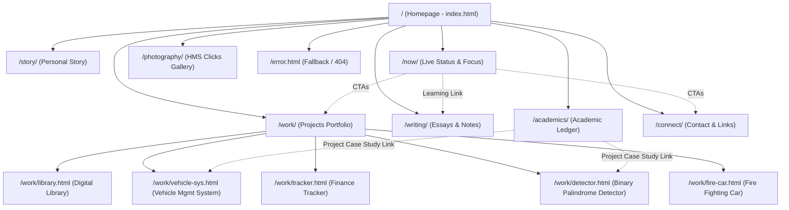

# hmsaeed.com — Audit

> **Document Purpose**: A complete blueprint and structural analysis of `hmsaeed.com`. Built to assist in evaluating site hierarchy, design aesthetics, user experience (UX), content organization, and identifying critical recommendations for refactoring and improvement.

---

## 1. Executive Summary & Site Overview

| Attribute                 | Details                                                                                                                                                 |
| :------------------------ | :------------------------------------------------------------------------------------------------------------------------------------------------------ |
| **Site Name**       | Hafiz Muhammad Saeed — Personal Presence System                                                                                                        |
| **Primary Domain**  | `https://hmsaeed.com`                                                                                                                                 |
| **Owner / Persona** | **Hafiz Muhammad Saeed** (BSCS Student @ UET Taxila, Builder, Reader, Thinker, Photographer)                                                      |
| **Core Value Prop** | A digital presence combining software engineering projects, academic ledgers, intellectual essays, live status updates, and macro photography.          |
| **Tech Stack**      | **Vanilla HTML5**, **Modern Modular CSS3** (Custom Properties/Design Tokens), **Vanilla JavaScript (ES Modules)**                     |
| **Asset Delivery**  | Cloudinary CDN (Images), Google Fonts (`Cormorant Garamond`, `DM Sans`, `Fira Code`)                                                              |
| **Analytics & SEO** | Google Analytics (`gtag.js` - G-T31PJSBQY8), Schema.org Structured Data (`Person`, `CollectionPage`, `ProfilePage`), Open Graph & Twitter Cards |

---

## 2. High-Level Sitemap & Information Architecture (IA)



---

## 3. Comprehensive Page-by-Page Audit

### 3.1. Homepage (`/` - `index.html`)

* **Purpose**: Gateway to the digital presence, introducing the persona, site directory, featured project, field notes, and testimonials.
* **Header / Meta**: SEO optimized, preloaded high-priority hero image, Open Graph tags.
* **Sections Breakdown**:
  1. **Splash Screen Loader (`#page-loader`)**: Enforces an artificial 2-second minimum delay (`MINIMUM_TIME = 2000`) before fading out logo mark.
  2. **Hero (`#hero`)**: Main headline ("I'm Saeed. Builder, Reader and Perpetual Learner"), Cloudinary portrait, WIP disclaimer banner (`⚠️ This site is a work in progress`).
  3. **Directory Index (`.directory-index`)**: Numbered sitemap listing:
     - `01 STORY` (Links to `story/index.html` - *Subtitle mentions "Coming Soon"*)
     - `02 NOW` (Links to `now/index.html`)
     - `03 WORK` (Links to `work/index.html`)
     - `04 WRITING` (Links to `writing/index.html`)
     - `05 Academics` (⚠️ *Broken link: points to `error.html` instead of `academics/index.html`*)
     - `06 PHOTOGRAPHY` (Links to `photography/index.html`)
  4. **Field Note (`.field-note`)**: Personal statement about gap year exploration (crochet, woodworking, Arabic, chess).
  5. **Featured Project (`.featured-project`)**: Showcases "UET Past Papers" (⚠️ *Points to `error.html`*).
  6. **Photography Interlude (`.photography-interlude`)**: High-impact macro photography feature with caption linked to `/photography/`.
  7. **Testimonials Marquee (`.testimonial-section`)**: Infinite scrolling marquee featuring 6 unique testimonials (Instructor, Collaborator, Senior Peer, Client, Study Partner, Teammate) with duplicate cards for smooth loop animation.
  8. **Closing Connect (`.closing-connect`)**: Teaser statement & link to `/connect/`.

---

### 3.2. Story Page (`/story/` - `story/index.html`)

* **Purpose**: In-depth personal biography, career transition narrative, and philosophical outlook.
* **Layout**: Single-column editorial layout optimized for long-form reading.
* **Sections Breakdown**:
  1. **Anchor Paragraph**: Origins (Lahore to Taxila), current age (20), transition from FSc Pre-Medical to BSCS.
  2. **The Gap Year**: Narrative of self-directed learning (Python, languages, crafts, football).
  3. **Photo Pause**: Embedded visual break with portrait.
  4. **Why CS**: Rationale for switching from Pre-Med to Computer Science at UET Taxila (2025).
  5. **Quiet Timeline**: Chronological journey (2006 to 2026 milestones).
  6. **Intellectual Interests**: Iqbal's concept of *Khudi*, systems thinking.
  7. **Outside Work**: Table tennis, chess, long walks, macro photography.
  8. **Closing CTAs**: Links to `/work/` and `/connect/`.
* **⚠️ Critical Issue**: Contains an inline `<style>` tag setting `body { filter: blur(8px); transform: scale(1.02); }`, making the entire page content blurry and unreadable!

---

### 3.3. Now Page (`/now/` - `now/index.html`)

* **Purpose**: Live snapshot of current focus, active projects, reading lists, and location pulse (inspired by Derek Sivers' `/now` movement).
* **Layout**: Two-column layout (Main content left, status sidebar right).
* **Sections Breakdown**:
  1. **Now Hero**: Clean title & intro declaration.
  2. **Manifesto**: Season update (Post 2nd-semester break, website rebuild focus).
  3. **Active Pursuits**: Split into **Building** (`hmsaeed.com`, Design Language) and **Learning** (DSA, Advanced JavaScript).
  4. **Past Seasons Archive**: Timeline of previous months (May 2026, March 2026).
  5. **Sidebar - Pulse Block**: Real-time clock widget displaying current time and location status (Lahore/Taxila).
  6. **Sidebar - Active Reading Block**: Interactive book widget showcasing *Macroeconomics by David Colander* (Page 80/512, 18% progress) with expandable "My Takeaways" toggle.
  7. **Closing CTA Banner**: Encourages checking back every few weeks or reaching out.

---

### 3.4. Work Portfolio & Subpages (`/work/` - `work/index.html`)

* **Purpose**: Showcase of engineering projects spanning web software, C++ OOP, and hardware circuits.
* **Features**: Dynamic category filter buttons (**All**, **Web**, **Hardware**).
* **Project Cards & Case Studies Hierarchy**:

| Project Title                        | Category       | Stack / Tech                                 | Case Study Page            | Demo / Source Links                         |
| :----------------------------------- | :------------- | :------------------------------------------- | :------------------------- | :------------------------------------------ |
| **Digital Library**            | Web App        | Vanilla JS, CSS3, HTML5                      | `/work/library.html`     | Live:`hmslibrary.netlify.app`Repo: GitHub |
| **Vehicle Management System**  | C++ OOP        | C++ OOP, File I/O                            | `/work/vehicle-sys.html` | Demo:`error.html` (⚠️)Repo: GitHub      |
| **Finance Tracker**            | Web App (PWA)  | MVC, Offline-First PWA, JS                   | `/work/tracker.html`     | Demo:`error.html` (⚠️)Repo: GitHub      |
| **Binary Palindrome Detector** | Hardware Logic | TTL ICs (7486, 7404, 7408), Breadboard       | `/work/detector.html`    | Repo: GitHub                                |
| **Fire Fighting Car**          | Robotics       | Flame Sensors, Motor Drivers, Logic Circuits | `/work/fire-car.html`    | Repo: GitHub                                |

* **Case Study Subpage Structure**: Each subpage (`library.html`, `vehicle-sys.html`, etc.) includes:
  - Header block with back navigation (`← Builds`), title, subhead, action buttons, and project metadata (Role, Timeline, Category).
  - Detailed architectural breakdown, design challenges, key takeaways, and source code previews.

---

### 3.5. Writing Page (`/writing/` - `writing/index.html`)

* **Purpose**: Platform for personal essays, technical notes, and open-source study guides.
* **Features**: Category filter chips (**All**, **Essays**, **Notes**, **Reflections**), interactive preview modal for Notion study guides.
* **Current Content**:
  - **Featured Post**: "On building slowly, and with intent" (⚠️ *Links to `error.html`*).
  - **Archive Entry**: "The shape of a personal system" (⚠️ *Links to `error.html`*).
  - **Notice**: "More essays, notes, and study guides are in progress."
  - **Interactive Preview Modal (`#notesModal`)**: Dynamic modal for displaying full post previews and Notion links.

---

### 3.6. Academics Page (`/academics/` - `academics/index.html`)

* **Purpose**: Transparent academic ledger detailing university coursework, grades, pre-university records, and test scores.
* **Sections Breakdown**:
  1. **Academics Hero**: Key stats banner showing current SGPA (**3.96**) and completion status ("Second Semester Done").
  2. **Semester Ledger (Accordion)**:
     - **Semester 1**: 5 courses (17 Credits) — GPA 3.96. Detailed breakdown of CS-111 (Prog Fund), CS-112 (ICT), MA-113 (Calculus), PH-114 (Physics), HU-115 (English).
     - **Semester 2**: 5 courses (17 Credits). Includes inline links to project case studies (e.g. CS-121 OOP links to `/work/vehicle-sys.html`, CS-122 DLD links to `/work/detector.html`).
  3. **Before UET Section**:
     - **Timeline**: Intermediate FSc at Jinnah Education System (90% Distinction, 2024), Matriculation (Grade A+, 2022).
     - **Competitive Exams Cards**: ECAT (**315 / 400**), MDCAT (**182 / 200**).

---

### 3.7. Photography Page (`/photography/` - `photography/index.html`)

* **Purpose**: Portfolio gallery for "HMS Clicks" focusing on macro photography, flora, and landscapes.
* **Features**:
  - **Full-Screen Dynamic Hero**: Immersive backdrop with animated counter stats (Total photos, Categories).
  - **Filter Bar & View Switcher**: Filter by category (Macro, Flora, Landscape) and toggle between **Rhythm View** (Masonry layout) and **Focus View** (Cinematic full-width layout).
  - **Interactive Lightbox (`#lightbox`)**: Touch/keyboard accessible viewer with image preloading, title, description, category tags, index counters, and prev/next controls.
  - **Data Source**: Powered by modular data file `src/js/data/photos.js`.

---

### 3.8. Connect Page (`/connect/` - `connect/index.html`)

* **Purpose**: Direct contact hub for project inquiries, engineering discussions, and networking.
* **Sections Breakdown**:
  - **Hero**: Friendly introductory invitation.
  - **Direct Action Buttons**:
    1. **Email**: `mailto:hms.builds@gmail.com`
    2. **LinkedIn**: `https://www.linkedin.com/in/hmsaeed`
    3. **WhatsApp**: `https://wa.me/923219798860?text=Hi%20Saeed%2C%20I%20saw%20your%20portfolio!`

---

### 3.9. Error / Fallback Page (`error.html`)

* **Purpose**: 404 error handling and temporary placeholder destination for unreleased posts or project demos.
* **Features**: Custom styled error message, back-to-home button, search prompt.

---

## 4. Design System & Technical Architecture

### 4.1. Visual & Aesthetic Identity

* **Design Philosophy**: Minimalist, warm, editorial, and organic modernism. Rejects generic dark/light defaults in favor of a tactile warm paper palette paired with muted botanical olive accents.
* **Typography Hierarchy**:
  - **Serif Display**: `Cormorant Garamond` (Headings, titles, quotes, numbers). Gives a literary, editorial personality.
  - **Sans-Serif Body**: `DM Sans` (Body text, UI elements, metadata, buttons). Clean, highly legible UI typography.
  - **Monospace Code**: `Fira Code` (Course codes, stats, code snippets, tags). Technical precision.

### 4.2. Color Tokens (`variables.css`)

```css
:root {
  --warm-bg:      #f7f4ef; /* Main Page Background (Soft Paper) */
  --olive:        #728649; /* Primary Accent (Sage / Olive Green) */
  --olive-lt:     #8a9e60; /* Light Accent & Scrollbar Thumb */
  --ink:          #2a2a22; /* Primary Text (Deep Charcoal) */
  --earth:        #8b6b4d; /* Muted Warm Earth Tone */
  --sky:          #5a8aa8; /* Secondary Cool Accent */
  --white:        #ffffff; /* Card Surface Color */
}
```

### 4.3. JavaScript & Component Architecture

The site utilizes zero-dependency Vanilla JS structured cleanly using modern ES Module imports:

- **`src/js/components/Navigation.js`**: Dynamically injects top navigation bar and mobile menu drawer across all pages. Features scroll direction detection (hides header when scrolling down, shows on scroll up) and intelligent active link highlighting.
- **`src/js/components/Footer.js`**: Dynamically injects standardized footer containing social links (GitHub, LinkedIn, Instagram) and copyright.
- **`src/js/components/Lightbox.js`**: Full-featured lightbox modal with keyboard navigation (`Esc`, `LeftArrow`, `RightArrow`), touch swipe detection, and preloading.
- **`src/js/utils/`**: Utilities for DOM operations, scroll reveals (`IntersectionObserver`), animation counters, filter handlers, and Notion modal triggers.

---

## 5. Key Discrepancies, Bugs & Workflows Friction Audit

During our deep structural inspection, the following critical issues and broken user workflows were discovered:

| # | Page / Location                    | Issue Description                                                                                                                                                                   | Impact / Friction                                                                  |
| :-: | :--------------------------------- | :---------------------------------------------------------------------------------------------------------------------------------------------------------------------------------- | :--------------------------------------------------------------------------------- |
| 1 | `index.html` (Line 275)          | Homepage sitemap item**05 Academics** links to `error.html` instead of `academics/index.html`.                                                                            | Users on the homepage cannot access the Academics ledger page!                     |
| 2 | `story/index.html` (Lines 87-93) | Inline`<style>` block applies `body { filter: blur(8px); transform: scale(1.02); }`.                                                                                            | The entire Story page is permanently blurred and unreadable for visitors.          |
| 3 | `index.html` (Line 321)          | Featured project "UET Past Papers" links to`error.html`.                                                                                                                          | Dead link on main homepage spotlight section.                                      |
| 4 | `writing/index.html`             | All featured and list post titles link to`error.html`.                                                                                                                            | Visitors clicking on essays are sent to 404 placeholder pages.                     |
| 5 | `work/index.html`                | Live Demo buttons for Vehicle Mgmt System & Finance Tracker point to`error.html`.                                                                                                 | Disappointing user experience for external visitors exploring project demos.       |
| 6 | `sitemap.xml`                    | `sitemap.xml` only lists `/`, `/story/`, `/work/`, `/writing/`, `/photography/`. It completely omits `/academics/`, `/connect/`, and the `/work/*.html` subpages. | Reduced SEO coverage and indexing penalty for key content pages.                   |
| 7 | `index.html` (Line 233)          | Homepage directory list labels`01 STORY` as "(Coming Soon)", but the page `story/index.html` actually exists!                                                                   | Misleads visitors into thinking the Story page does not exist yet.                 |
| 8 | `index.html` (Lines 562-583)     | Hardcoded JavaScript splash screen forces a minimum 2.0 second loading delay on every home page visit.                                                                              | Increases Time to Interactive (TTI) and delays content access for repeat visitors. |

---

## 5. Key Discrepancies, Bugs & Workflows Friction Audit

During our deep structural inspection, the following critical issues and broken user workflows were discovered:

| # | Page / Location                    | Issue Description                                                                                                                                                                   | Impact / Friction                                                                  |
| :-: | :--------------------------------- | :---------------------------------------------------------------------------------------------------------------------------------------------------------------------------------- | :--------------------------------------------------------------------------------- |
| 1 | `index.html` (Line 275)          | Homepage sitemap item**05 Academics** links to `error.html` instead of `academics/index.html`.                                                                            | Users on the homepage cannot access the Academics ledger page!                     |
| 2 | `story/index.html` (Lines 87-93) | Inline`<style>` block applies `body { filter: blur(8px); transform: scale(1.02); }`.                                                                                            | The entire Story page is permanently blurred and unreadable for visitors.          |
| 3 | `index.html` (Line 321)          | Featured project "UET Past Papers" links to`error.html`.                                                                                                                          | Dead link on main homepage spotlight section.                                      |
| 4 | `writing/index.html`             | All featured and list post titles link to`error.html`.                                                                                                                            | Visitors clicking on essays are sent to 404 placeholder pages.                     |
| 5 | `work/index.html`                | Live Demo buttons for Vehicle Mgmt System & Finance Tracker point to`error.html`.                                                                                                 | Disappointing user experience for external visitors exploring project demos.       |
| 6 | `sitemap.xml`                    | `sitemap.xml` only lists `/`, `/story/`, `/work/`, `/writing/`, `/photography/`. It completely omits `/academics/`, `/connect/`, and the `/work/*.html` subpages. | Reduced SEO coverage and indexing penalty for key content pages.                   |
| 7 | `index.html` (Line 233)          | Homepage directory list labels`01 STORY` as "(Coming Soon)", but the page `story/index.html` actually exists!                                                                   | Misleads visitors into thinking the Story page does not exist yet.                 |
| 8 | `index.html` (Lines 562-583)     | Hardcoded JavaScript splash screen forces a minimum 2.0 second loading delay on every home page visit.                                                                              | Increases Time to Interactive (TTI) and delays content access for repeat visitors. |

---

## 6. Strategic Recommendations & Optimization Plan

### Phase 1: Immediate Bug Fixes & Repair

1. **Fix Academics Navigation Link**: Update `index.html` line 275 from `href="error.html"` to `href="academics/index.html"`.
2. **Remove Blurring from Story Page**: Remove the test `<style>` block in `story/index.html` (`filter: blur(8px)`).
3. **Correct Homepage Directory Label**: Remove `(Coming Soon)` text from `01 STORY` in `index.html`.
4. **Update `sitemap.xml`**: Add missing URLs: `https://hmsaeed.com/academics/`, `https://hmsaeed.com/connect/`, and individual case study URLs.

### Phase 2: Navigation & Information Architecture Overhaul

1. **Unify Primary Navigation**: Currently, `Navigation.js` injects: `Story`, `Builds` (`/work/`), `Writings` (`/writing/`), `Photography`, `Connect`. Notice that **Academics** and **Now** are missing from the global header navigation!
   - *Recommendation*: Add `Now` and `Academics` into the global header or drop-down menu so users can reach every section from any page without returning to the homepage index.
2. **Standardize Labeling**: Resolve naming inconsistencies:
   - In Header: "Builds" vs Homepage: "WORK" vs Case study back link: "Builds".
   - In Header: "Writings" vs Homepage: "WRITING".
   - Standardize across all pages to a single unified vocabulary.

### Phase 3: UX & Content Enhancement

1. **Optimize Splash Screen**: Change the splash loader script in `index.html` to check `sessionStorage`. Show the 2-second splash screen only once per session, rather than forcing a 2-second delay on every refresh.
2. **Connect Page Enrichment**: Expand `/connect/` by adding an embedded lightweight contact form (or Formspree integration) alongside direct social buttons.
3. **Writing Section Publishing Pipeline**: Create initial full-text HTML template pages for featured articles rather than sending all article clicks to `error.html`.
4. **Case Study Consistency**: Ensure all 5 projects in `/work/` have complete, uniform case study content, screenshots, and live demo fallbacks (e.g., interactive code sandbox or GitHub release links instead of `error.html`).

---

*Document compiled on: 2026-07-28*
*Prepared for: Strategic Architecture & UX Review*
